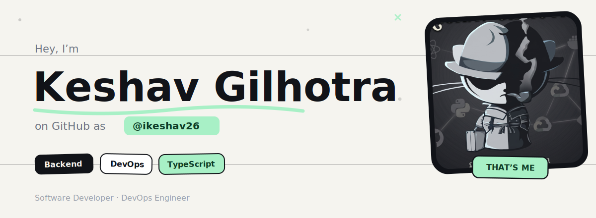

 

Pre-final year CS student who leans into open-source and collaborative engineering. I build backend systems and dev tooling, and spend a good chunk of time on the infra side — containers, CI/CD, and getting things to run reliably in production, not just on my machine.

 

## Tech I work with

**Languages** — JavaScript · TypeScript · Java · Python  
**Web & Backend** — React · Next.js · Node.js · Express.js · Spring Boot  
**Databases** — PostgreSQL · MySQL · MongoDB · Redis · Prisma · Drizzle ORM  
**DevOps & Infra** — Docker · DigitalOcean · Nginx · Terraform · Ansible · GitHub Actions · Linux  
**Observability** — Kafka · BullMQ · Prometheus · Grafana  
**Tooling** — Git · VS Code · Neovim · IntelliJ IDEA

 

